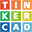
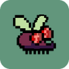

# Hi, I'm Gui! Welcome to my page 

<!-- Introduction -->

    I'm from São Bernardo do Campo  São Paulo 
     Alumni at <a href="https://developeracademy.mackenzie.br/">Apple Developer Academy | Mackenzie</a> & <a href="https://developer.apple.com/entrepreneur-camp/"> Apple Entrepreneur Camp</a>
     See my resume <a href="files/GuiReis_CV-pt.pdf">PT</a> / <a href="files/GuiReis_CV-en.pdf">EN</a>

<!-- Social media -->

<!-- Instagram -->
    
<!-- Facebook -->
    
<!-- LinkedIn -->
    
<!-- Medium -->
    
<!-- App Store -->
    
<!-- StackOverflow -->
    
<!-- Linktree -->
    

----------
## About me 😁

    I'm 25 years old and I graduated from Universidade Presbiteriana Mackenzie in Computer Science.
     I love what I do, I love studying about programming, solving problems, challenging myself and creating apps, which is also my area that I seek to work in: iOS developer.
     Since the beginning of my studies, I've tried to apply good practices and always understand how things work: "why that", "how to do that".. Because of that I have a baggage of good practices and programming logic.
     I focus on performance when writing code, thinking about different strategies to be able to bring the best solution, including being the subject of my final paper.
     I also have a very strong practice in documentation and methodology, doing a Technological Initiation in this area during my college period.

----------
## My projects 😎

    I constantly study through personal projects, always looking for the most suitable good practices for each context and documenting what I learn in articles and self-made guides.
     Almost every repository has a detailed README, and some go further with full wikis. Most of that documentation started in Portuguese because there are few courses and tutorials in Brazilian Portuguese, but I'm translating everything to reach more people. These repositories work as a portfolio and as a way to help anyone new to programming or curious about the topics inside. Feel free to open an issue or leave a star!!

----------
## My Development Stack
<table align="center" style="margin: 0px auto;">
    <tr>
        <td><h3 align="center">Application and Data</h3></td>
        <td><h3 align="center">DevOps</h3></td>
        <td><h3 align="center">Utilities</h3></td>
        <td><h3 align="center">Other</h3></td>
    </tr>
    <tr>
        <td>
            
            
            
            
            
            
            
        </td>
        <td>
            
            
            
            
            
        </td>
        <td>
            
            
            
            
        </td>
        <td>
            
            
        </td>
    </tr>
</table>

 

----------
## Apps and Programs I Built or Collaborated On
<table>
    <!-- >>>>>>>>>>>>>>>>>>>> Row 01 <<<<<<<<<<<<<<<<<<<<<< -->
    <tr>
        <!-- Hortali -->
        <td>
            <table>
                <tr>
                    <td align="center">
                        
                        
<b>Hortali</b>

                    </td>
                    <td rowspan="2" width = 400 valign="top">
                        Hortali is an app I'm very proud of! Its purpose is to help anyone who might face food insecurity by highlighting organic community gardens in São Paulo and sharing information about local produce, such as seasonality and vitamins.
                    </td>
                </tr>
                <tr>
                    <td>
                        
                    </td>
                </tr>
            </table>
        </td>
        <!-- Inkolors -->
        <td>
            <table>
                <tr>
                    <td align="center">
                        
                        
<b>Inkolors</b>

                    </td>
                    <td rowspan="2" width=400 valign="top">
                        Inkolors was my first iOS app. It's a simple color theory game where you identify primary, secondary, and tertiary colors by placing them in the correct spot and understanding which combinations generate each tone.
                    </td>
                </tr>
                <tr>
                    <td>
                        
                    </td>
                </tr>
            </table>
        </td>
        <!-- Ball Runner -->
        <td>
            <table>
                <tr>
                    <td align="center">
                        
                        
<b>Ball Runner</b>

                    </td>
                    <td rowspan="2" width = 400 valign="top">
                        Ball Runner was the first app I built entirely on my own. It was inspired by a game I always loved that only existed on Android. You dodge the red balls—the longer you endure, the higher your score.
                    </td>
                </tr>
                <tr>
                    <td>
                        
                    </td>
                </tr>
            </table>
        </td>
        <!-- Coverless -->
        <td>
            <table>
                <tr>
                    <td align="center">
                        
                        
<b>Coverless</b>

                    </td>
                    <td rowspan="2" width = 400 valign="top">
                        Coverless was an accessibility study from concept to features. The app recommends books based only on the synopsis, without showing the cover, and it helped me dig deep into API integrations.
                    </td>
                </tr>
                <tr>
                    <td>
                        
                    </td>
                </tr>
            </table>
        </td>
        <!-- Datas em Dias -->
        <td>
            <table>
                <tr>
                    <td align="center">
                        
                        
<b>Datas em Dias</b>

                    </td>
                    <td rowspan="2" width = 400 valign="top">
                        This desktop application brought together everything I had learned so far: best practices, desktop UI, OOP, PyQT, documentation... Its purpose is to calculate the interval in days between two selected dates.
                    </td>
                </tr>
                <tr>
                    <td>
                        
                    </td>
                </tr>
            </table>
        </td>
        <!-- Kaos Bot -->
        <td>
            <table>
                <tr>
                    <td align="center">
                        
                        
<b>Kaos Bot</b>

                    </td>
                    <td rowspan="2" width = 400 valign="top">
                        Kaos Bot was the first bot I ever worked on. My college friends and I built it during the pandemic to stir things up on Discord servers—hence the name: chaos.
                    </td>
                </tr>
                <tr>
                    <td>
                        
                    </td>
                </tr>
            </table>
        </td>
    </tr>
    <!-- >>>>>>>>>>>>>>>>>>>> Row 02 <<<<<<<<<<<<<<<<<<<<<< -->
    <tr>
        <!-- The Midway -->
        <td>
            <table>
                <tr>
                    <td align="center">
                        
                        
<b>The Midway</b>

                    </td>
                    <td rowspan="2" width = 400 valign="top">
                        The Midway was the first idea that truly excited me: an app that finds the midpoint on a map using the addresses you enter, so you can meet your friends halfway.
                    </td>
                </tr>
                <tr>
                    <td>
                        
                    </td>
                </tr>
            </table>
        </td>
        <!-- Catch Fly -->
        <td>
            <table>
                <tr>
                    <td align="center">
                        
                        
<b>Catch Fly</b>

                    </td>
                    <td rowspan="2" width = 400 valign="top">
                        Catch Fly is a fully fledged hypercasual game. I focused on sound design and Game Center integration during development, but the main goal was to dive deep into creating a complete game design document (GDD)—the template I still use for my READMEs came from this project.
                    </td> 
                </tr>
                <tr>
                    <td>
                        
                    </td>
                </tr>
            </table>
        </td>
        <!-- Caminholas -->
        <td>
            <table>
                <tr>
                    <td align="center">
                        
                        
<b>Caminholas</b>

                    </td>
                    <td rowspan="2" width = 400 valign="top">
                        My first app outside the Apple Academy, a drinking game inspired by nights out with friends. We used to play it in the Notes app, so I turned it into a real experience. Sadly, Apple doesn't allow it on the store. :/
                    </td>
                </tr>
                <tr>
                    <td>
                        
                    </td>
                </tr>
            </table>
        </td>
        <!-- Maria Cacau -->
        <td>
            <table>
                <tr>
                    <td align="center">
                        
                        
<b>Maria Cacau</b>

                    </td>
                    <td rowspan="2" width = 400 valign="top">
                        One of the first pieces of software where every new version showed how much I was evolving. It's a desktop program for the Maria Cacau company that summarizes the orders for a selected period and the types of deliveries they need to plan.
                    </td>
                </tr>
                <tr>
                    <td>
                        
                    </td>
                </tr>
            </table>
        </td>
        <!-- Base Convertor -->
        <td>
            <table>
                <tr>
                    <td align="center">
                        
                        
<b>Base Convertor</b>

                    </td>
                    <td rowspan="2" width = 400 valign="top">
                        This was the first application I built with a graphical interface. It converts integer numbers between bases, one of the earliest topics I learned in computer science, and it was amazing to watch how far the project evolved!
                    </td>
                </tr>
                <tr>
                    <td>
                        
                    </td>
                </tr>
            </table>
        </td>
    </tr>
</table>

----------
## My activity:

    &nbsp;&nbsp;&nbsp;&nbsp;&nbsp;&nbsp;
    

